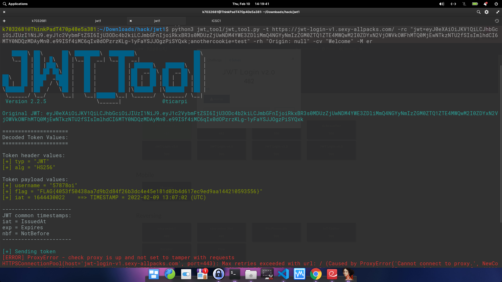

# JWT Login v1.0

## Enunciado

Hay un enlace y el archivo ./main.py

En el enlace hay:

Field: Username
CTA: Login

El archivo main.py es un archivo de python, el cual crea un Flask environment

## Solución

Al ejecutar main.py se ve una página web, la cual tiene un 
 y ese div tiene la siguiente clase: class="pin-prompt" la cual en sus propiedades CSS esta oculto: display:none;

Se elimina esa línea de CSS y pide un PIN para poder realizar debug, el debug para desbloquear está como salida en la consola que corre el archivo de python.

En enlace de la página puede tener la misma estructura del Flask environment, al ingresar un username, esto genera un token que se guarda en las cookies del navegador para ese dominio.

El token es un JTW (Json Web Token), se busca una herramienta que pueda validar, escannear y manipular JWTs.

#### ¿Qué es un Json web token?

Es un estándar, mecanismo, cadena de texto que tiene 3 partes codificadas en Base64, para enviar la identidad de un usuario entre dos partes. Esas 3 partes son:

- Header
- Payload
- Signature

### Herramienta extra

JWT-TOOL: https://github.com/ticarpi/jwt_tool

Se envía la URL del reto en una petición Http, con la bandera -t, con el token.

También se envía la bandera -rc para solicitar las cookies y -rh para solicitar los encabezados y enviar con la solicitud HTTP falsificada.

$ python3 jwt_tool/jwt_tool.py -t https://jwt-login-v1.sexy-allpacks.com/ -rc "jwt=<token>;anothercookie=test" -rh "Origin: null" -cv "Welcome" -M er

La bandera -cv recibe la cadena de texto que aparece en respuesta a un token válido y -M determina el modo de escaneo, que pueden ser de cuatro tipos:

    - pb: Playbook audit
    - er: Fuzz existing claims to force errors
    - cc: fuzz common claims
    - at: All Tests!

La salida del comando muestra los valores decodificados del Token

