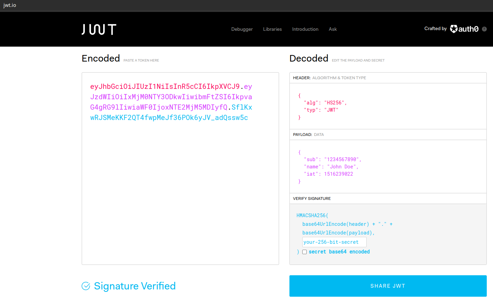

# JWT Version 2

## Enunciado

Hay un enlace y el archivo ./main.py

En el enlace hay:

Field: Username
CTA: Login

El archivo main.py es un archivo de python, el cual crea un Flask environment

## Solución

Al igual que la versión 1 el tipo de algoritmo es HS256 y la diferencia está en que comprueba la bandera is_admin, entonces se tiene en cuenta la solución de la versión 1, pero en esta versión se modifica 1 de las 3 partes del JWT.

### ¿Cómo modificar el JWT sin invalidarlo?

Por medio de la siguiente herramienta se decodificaban las partes del base 64:

https://www.base64decode.org/

Y este debugger permite ver las tres partes: https://jwt.io/

Y esta herramienta permite codificar a Base64 y a otras bases:

https://gchq.github.io/CyberChef/

Modificando así el algoritmo que tiene pasando:

    {
    "alg": "none",
    "typ": "JWT"
    }

Después de modificado el token, se utiliza la herramienta mencionada en la versión 1 con el token modificado para obtener la Flag:

$ python3 jwt_tool/jwt_tool.py -t https://jwt-login-v2.sexy-allpacks.com/ -rc "jwt=<tokenModificado>;anothercookie=test" -rh "Origin: null" -cv "Welcome" -M er
