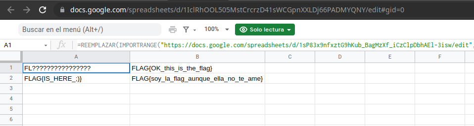
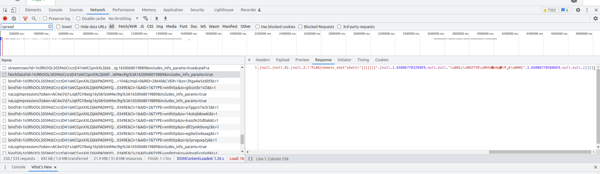

## RSA Small

## Enunciado
 
Esta el siguiente link:

https://docs.google.com/spreadsheets/d/1IclRhOOL505MstCrcrzD41sWCGpnXXLDj66PADMYQNY/edit#gid=0

El cual es una hoja de cálculo de Google Drive compartida:

### Análisis

Como se ve en la imagen, la primera celda tiene la función IMPORTRANGE que llama a otra hoja de cálculo, la cual esta privada, sin embargo al llamar datos de esa otra hoja debe existir un request.

### Solución

En la petición: https://docs.google.com/spreadsheets/u/1/d/1IclRhOOL505MstCrcrzD41sWCGpnXXLDj66PADMYQNY/externaldata/fetchData?id=1IclRhOOL505MstCrcrzD41sWCGpnXXLDj66PADMYQNY&sid=355e1dc5a79df791&vc=0&c=0&w=0&flr=0&smv=104&token=AC4w5Vj1sJqKfGY8wig16yS8rlsWMec9Ig%3A1650068019889&includes_info_params=true

Se observa el response:

[null,[[null,"customFunctionMap",null,[null,null,null,null,""]],[null,"protectedRangeInfo","[]",[null,0.0,null,null,"d751713988987e9331980363e24189ce"]],[null,"dbExecutionInfo",null,[null,0.0,null,null,"e3b0c44298fc1c149afbf4c8996fb92427ae41e4649b934ca495991b7852b855"]],[null,"{1\u003d4,7\u003d{1\u003d44#1sP83x9nfxztG9hKub_BagMzXf_iCzClpDbhAEl-3isw,2\u003d2#A1}}","[null,1,1,[[null,0,[[null,0,[null,[null,0],[null,2,\"FLAG{sheets_shot^shot}\"]]]]]]]",[null,1.650067783294E9,null,null,"\u001c\u0027YD\u003d�e6@�lPژ$\u0001",1.650067783686E9,null,null,[]]]]]

En el cual está la Flag

